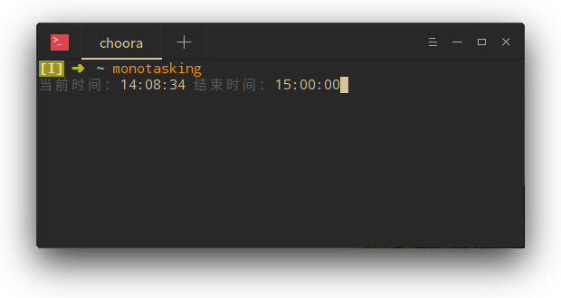

# monotasking

_“单核工作法”闹钟。_

## 背景

适合“单核工作法”使用的闹钟，按照“分针下一个竖直位置；时长不小于 25 分钟”的规则，自动判断闹钟的结束时间。

## 选项

* `-h, --help` 显示帮助信息。

## 更新

* _2018/07/22_
  * 完成基本功能。
  * 编写帮助信息。
  * 编写测试脚本。
  * 编写自动补全命令。
  * 编写文档。

* _2018/07/21_
  * 完成部分功能。
