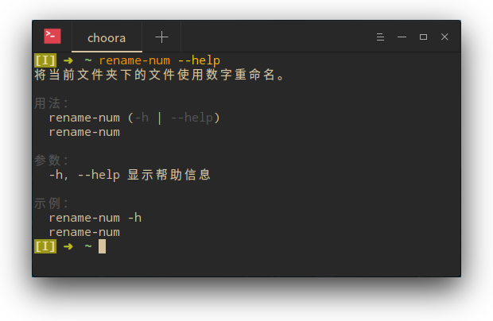

# rename-num

_将当前文件夹下的文件使用数字重命名。_

## 背景

适用于当文件内容较多又无顺序时使用，若文件有顺序（_e.g._ 漫画图片），必须确保原本文件顺序（以 `ls` 结果为准）是正确的，最好谨慎使用。

## 选项

* `-w, --equal-width`，若开启则文件名使用 0 占位，推荐开启。

> **注意：** 若文件数不足 10 个，也会使用 0 占位。

* `-h, --help`，显示帮助信息。

## 更新

* _2017/08/14_
  * 完成脚本。
  * 完成帮助信息。
  * 完成自动补全。
  * 完成帮助信息。
  * 完成文档。
  * 在文档中加入图片。
