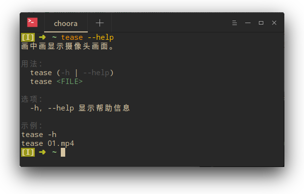

# tease

_画中画显示摄像头影像。_

## 背景

我最近又开始跳 INSANITY 健身操了，但是家中没有足够大的镜子，我无法得知自己的姿势的标准程度。这个脚本可以使用 mpv 全屏播放视频，并在右上角显示摄像头影像，可以嘲笑一下自己的姿势多么可笑。除了跳健身操，学舞蹈等等也可以使用。

## 参数

* `FILE` 文件名

> **注意：** 只能有一个参数，也就是不能播放多个文件，不过通配符应该可以使用，觉得没有必要就未测试。

## 选项

* `-h, --help` 显示帮助信息

## 问题

* 如果动作快了，则影像不是很同步，需要增加帧数。
* 如果在摄像机影像窗口中途按了暂停，之后则很不流畅，也许需要加上缓存设置。

## 更新

* _2017/08/24_
  * 完成脚本。
  * 完成帮助信息。
  * 完成测试脚本。
  * 完成文档。
  * 完成自动补全。
  * 加入问题记录。

